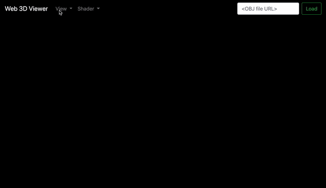

# Web 3D Viewer

## Description:
A 3D model viewer on the web

## Dependency:
1. webpack boilderplate from https://github.com/taniarascia/webpack-boilerplate
2. Babylonjs
3. Bootstrap
4. jQuery

## Todo:
1. Use a web modular UI development framework such as react/vue.
2. Add more features when 1 is done.
